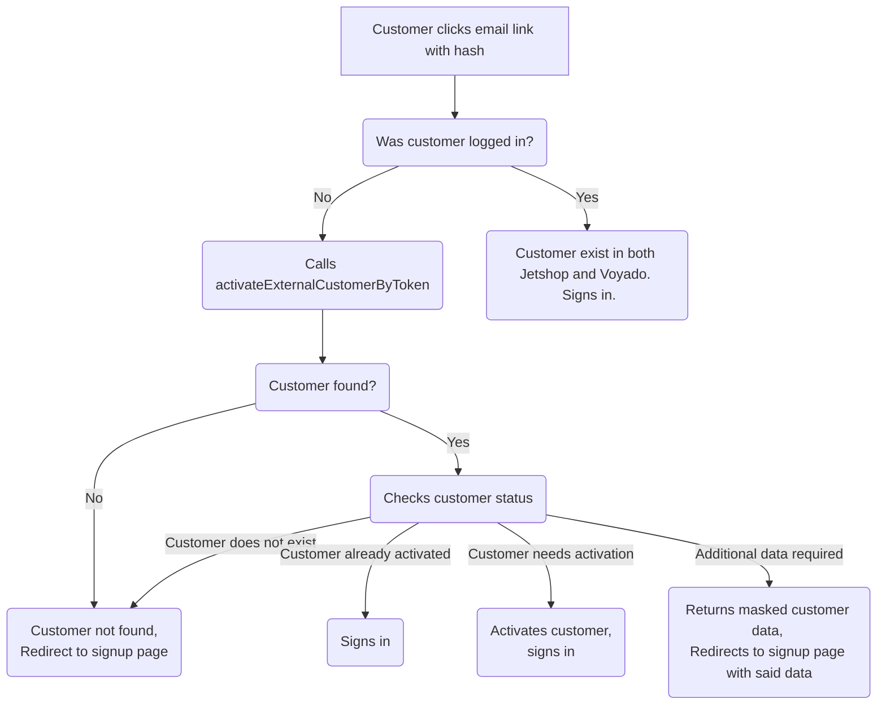

# @jetshop/flight-voyado

The module provides a set of hooks needed to control the UI regarding both activation and/or signup flow using Voyado. For the complete integration to work, the customer must exist in both Jetshop and Voyado.

There are three possible states covered by this module which the customer may end up in, each containing up to four sub-states. To get to any of these states, the end customer has two options:

1.  Using a **semi login** link provided by Voyado.
2.  Using the **lookup field** provided from inside the store.

From both of these, the API is returning a current customer status. There are four statuses to be returned:

1. **CustomerNotFound:** The customer does not exist in either Jetshop nor Voyado.
2. **CustomerAlreadyActivated:** The customer exists in both Jetshop and Voyado. No further action needed.
3. **ActivationRequired:** The customer exists in Voyado, but not in Jetshop. The account needs activation in order for us to create the customer in Jetshop too.
4. **AdditionalUserDataRequired:** The customer exists in Voyado, but there are fields in Jetshop that are required in order to create the customer. The API is returning the fields that are present in Voyado.

The hooks may be initialized with an object as an argument controlling the outcome for some of the states.

### useVoyadoLookup

#### Arguments

The hooks takes a single options object as an argument, with the following keys:

| Argument           | Type    | Default | Description                                                                                     |
| ------------------ | ------- | ------- | ----------------------------------------------------------------------------------------------- |
| activateOnLookup   | Boolean | True    | This controlls whether the end customer should manually activate the account after the lookup.  |
| signInOnActivation | Boolean | False   | This controlls whether the end customer should manually login after previously said activation. |

_Note:_ the hook may be initialized with all **or** some of the keys.

The hook is returning a set of self explanatory booleans to controll the UI.
Something like:

```jsx
const { activate, ...voyado } = useVoyadoLookup({
  activateOnLookup: false,
  signInOnActivation: false,
});

if (voyado.isActivationRequired) {
  return (
    <TrendButton onClick={activate}>
      The account has been activated. Click here to login.
    </TrendButton>
  );
}
```

If you'd like to show something to indicate that the account is being activated, you could do something like:

```jsx
const { ...voyado } = useVoyadoLookup({
  activateOnLookup: false,
  signInOnActivation: false,
});

if (voyado.isActivationPending) {
  return (
    <div>
      Activating account...
      <Spinner />
    </div>
  );
}
```

The hook is also returning all functions needed to call the lookup, to retry the lookup and to call the activation mutation.
Like so:

```jsx
const { activate, ...voyado } = useVoyadoLookup({
  activateOnLookup: false,
  signInOnActivation: true,
});

if (voyado.isActivationRequired) {
  return <button onClick={activate}>Activate my account please dear</button>;
}
```

_Note: To avoid impossible states, the functions can only be called inside a few different states. IE: The activate function has no effect when the API has returned AdditionUserDataRequired, or when the activation is pending etcetc._

In addition to this, the hook is also returning the customer data for you to pre-fill the form with if requested.

In the example store, we're saving the potential customer to state, like so:

```jsx
// SignInPage:
function ExternalLookupField() {
const  {  ...voyado  }  =  useVoyadoLookup({
	activateOnLookup:  false,
	signInOnActivation:  false
});
return(
if (voyado.IsAdditionalDataRequired) {
	return (
		<Redirect to={{ pathname: '/signup', state: {...voyado} }} />
	);
}
)
}

// SignupPage:
function SignupPage() {
const { state } = useLocation();
 return (
	 <SignupFormProvider lookupData={state.customer}>
	 // rest of form
	 </SignupFormProvider>
 )
}
```

Then, on signup, you could grab it using the useLocation hook provided from react-router-dom. SignupFormProvider is handling all prefilling for you as long as you pass the data along to it. If you'd like to manipulate the data before it. If, for example, the email should be left out of the prefilling, just delete it before passing it along.

### VoyadoProvider

#### Arguments

| Argument          | Type    | Default   | Description                                                                                  |
| ----------------- | ------- | --------- | -------------------------------------------------------------------------------------------- |
| loginPath         | String  | '/login'  | Route to redirect to if the customer exist, and manually should login.                       |
| signupPath        | String  | '/signup' | Route to redirect to if the customer does not exist.                                         |
| loginOnActivation | Boolean | True      | This controlls whether the end customer should be logged in when clicking a semi login link. |
| manualActivation  | Boolean | False     | This controlls whether the end customer should be activated upon clicking a semi login link. |

_Note:_ the hook may be initialized with all **or** some of the keys.

## Activation chart

By default, this is how it's handled:
_Note: the outcome can be controlled by the arguments mentioned above_


